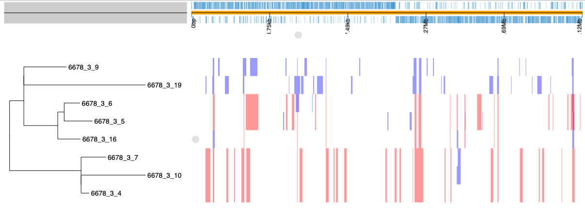

# Generating and analysing alignments with Gubbins

## Dataset

This dataset comprises a handful of genomes from *S. pneumoniae* PMEN3, a multidrug-resistant strain described in detail in [D'Aeth *et al*](https://elifesciences.org/articles/67113). It can be downloaded from [FigShare](https://figshare.com/account/projects/130637/articles/18700289). This consists of one complete reference sequence (*S. pneumoniae* RMV4) and eight draft genomes. These can be extracted with the command:

```
tar xfz PMEN3_assemblies.tar.gz
```

## Generating the alignment

The draft genomes can be aligned to the reference using [SKA](https://github.com/simonrharris/SKA). This is first installed through conda:

```
conda install -c bioconda ska
```

An index file is then generated to name the isolates to be aligned:

```
for f in 6678*fa; do echo "${f%.fa}\t${f}"; done > PMEN3_isolates.list
```

The `PMEN3_isolates.list` should contain this text:

```
6678_3_10    6678_3_10.fa
6678_3_16    6678_3_16.fa
6678_3_19    6678_3_19.fa
6678_3_4    6678_3_4.fa
6678_3_5    6678_3_5.fa
6678_3_6    6678_3_6.fa
6678_3_7    6678_3_7.fa
6678_3_9    6678_3_9.fa
```

The alignment is then constructed using the Gubbins script `generate_ska_alignment.py`:

```
generate_ska_alignment.py --reference RMV4.fa --fasta PMEN3_isolates.list --out PMEN3.aln
```

## Analysis with Gubbins

The resulting whole genome alignment can then be analysed using Gubbins:

```
run_gubbins.py --prefix PMEN3 PMEN3.aln
```

This should complete in under a minute. The results can be visualised using the website https://jameshadfield.github.io/phandango. Three files can be dragged and dropped onto the loading screen:

* `PMEN3.final_tree.tre`

* `PMEN3.recombination_predictions.gff`

* `RMV4.gff`

The output should resemble this image:


The tree is on the left, and the refence annotation is across the top. The red bars indicate recombinations reconstructed as occurring on internal branches, which are therefore shared by isolates through common ancestry. The blue bars indicate recombinations reconstructed as occurring on terminal branhces, which are unique to individual isolates. The graph at the bottom summarises the distribution of recombination across the genome, with peaks corresponding to loci encoding antigens (e.g. the *cps* locus and *pspA*) and resistance loci (e.g. *murM*).
